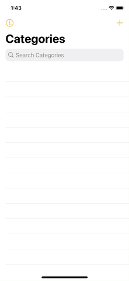

# Notes
Android Version: [link](https://github.com/Lambz/Notes-Android-Application)
 
It is a native application for iPhone or iPad that allows the user to take and organize notes.  The notes should be stored with the time and date of creation.
 The application have the following features:
- Data is stored with CoreData
- User are able to search for specific note by title or by keyword that may be contained in a note
- User are allowed to take picture (or use a picture that was previously taken) and store it as part of a note
- User location that is the information on where the note is taken is captured as part of the note
- User later is able to see the location on a map for every note that was taken
- User is able to record audio and associate the audio file with the note
- User is able  to change the subject/category of a note i.e. move a note from one subject/category to another
 

### Splash Screen

  

 

### Add Category

  

 

### Add Note

  
  

 

### Editing Note

  

 

### Deleting Note

  
  
  

 

### Moving a Note

  
  

 

### Search Category

  

 

### Search Note

  

 

### Add Images in Note

  

 

### Location of the Note

  

 

### Listening to Audio later on

  

 

### Information 

  

 
